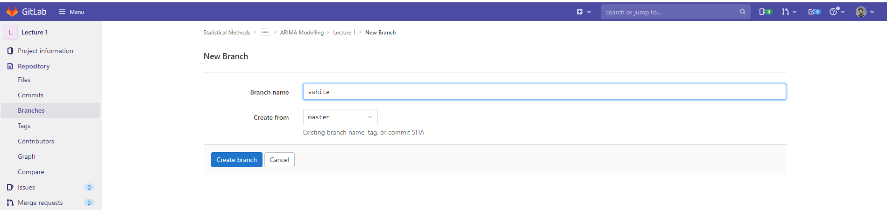

# StatsNZ ARIMA Training 2021 - Lecture 1

[Lecture 1 Video](https://statsnewzealand-my.sharepoint.com/:v:/r/personal/steve_white_stats_govt_nz/Documents/Recordings/ARIMA%20Modelling%20-%20Lesson%201-20210923_094007-Meeting%20Recording.mp4?csf=1&web=1&e=dTMYc8)

## Exercise I  

**Note:** *This exercise might be a good litmus test to see if you have the time to dedicate to the course as this will be the least demanding exercise.*

***  

* Find a monthly series time series which is at least 15 years in length. It
can be anything you find interesting, so does not have to be a StatsNZ
series. You might want to consult others to see if someone else is interested
in it too. While it is much better if you do your own analysis on a time
series it is helpful if, after you have done your work, you can compare
your results with someone independently working on the same time series.

* If your are struggling to think of anything here are some suggestions
    * Monthly visitor arrivals
    * Monthly merchandise exports
    * Monthly residential building consents
* Get your series into an R time series object.
* Plot the series. You have succeeded in previous step if the x-axis has date labels.
* Put a line at any time point. In other words, if you talk about a series at
March 2004, for example, can you put a line at that point?
* Produce the ACF for your time series.

## Submitting work

I would suggest creating a branch with your name or username.  For example, I will create a branch called `swhite`.  The graphical way to do that is to just use the website:

Feel free to create a study-group branch too! The current idea is that I will pencil in a 1-hour review session at some point before the next lecture to share and discuss work.  Maybe a week prior.  

## Other notes

I realise everyone may not be up-to-speed on using GitLab.  I will collect feedback prabably with a Google forms to gauge what what we might want to do to get up to speed with certain things

